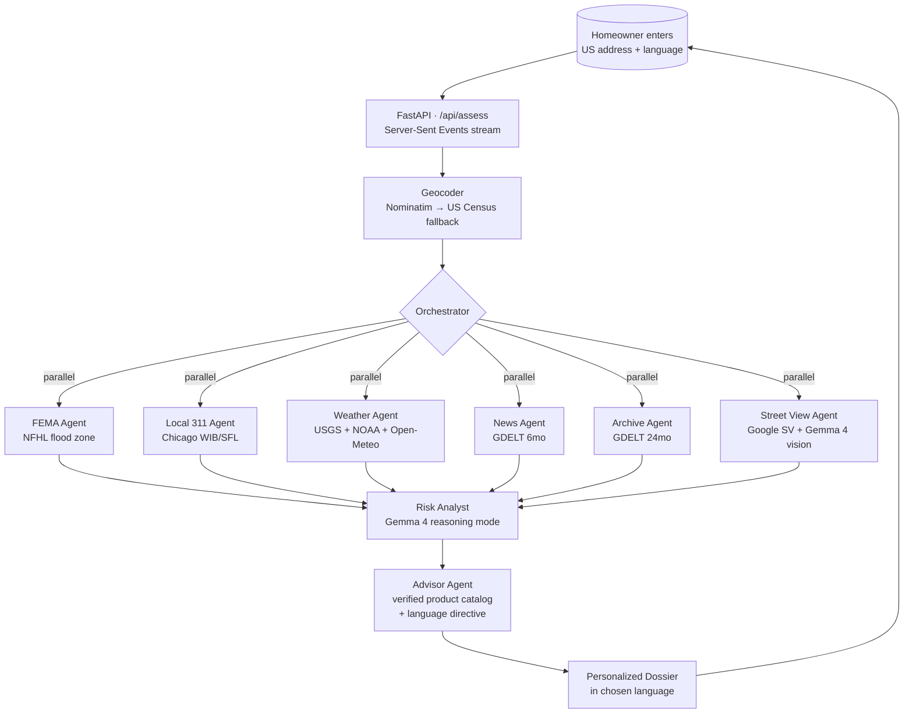

# FlutIQ

**Flood risk advice that doesn't make you Google "what is AEP."**

A multi-agent flood-risk advisor for US homeowners, built for the
[Gemma 4 Good Hackathon](https://www.kaggle.com/competitions/gemma-4-good)
(Global Resilience track). Type an address, get a personalized dossier
that explains your actual flood risk and the *real, currently-available*
insurance products that fit the property — not the made-up ones an LLM
might generate from outdated training data.

🌊 **Live demo:** [kredd25-flutiq.hf.space](https://kredd25-flutiq.hf.space)
&nbsp;·&nbsp;
**Status:** v0.7 · beta

> **Mission:** reduce the complexity and scariness of insurance.
> The technical pitch (FEMA-gap, Gemma 4 reasoning, multi-agent
> orchestration) is the vehicle; the goal is making a homeowner feel
> less overwhelmed about their flood-insurance decisions.

---

## What's new in v0.7

- 🌐 **Multi-language dossier** (Spanish, Mandarin, Vietnamese, Haitian
  Creole, Arabic, Tagalog) — pick from a dropdown in the chrome bar.
  User-facing copy translates; product names, URLs, and dollar amounts
  stay English so the homeowner can still call the right number.
- 📷 **Street View vision agent** — fetches a Google Street View image
  of the property and asks Gemma 4 (multimodal) to identify visible
  flood-risk indicators: basement-level windows, ground-floor HVAC,
  drainage infrastructure, evidence of past water damage, elevation
  vs street. Honest about what it can't see — won't fabricate features.
- 🚀 **Single-Space deploy** — backend + bundled frontend on one HF
  Space, one URL, no CORS dance.
- 🏘️ **US Census Geocoder fallback** — addresses that Nominatim doesn't
  know now resolve via TIGER/Line.
- ✅ **Verified insurance catalog** — the advisor agent can no longer
  invent products. All recommendations come from a hand-curated
  catalog of real, currently-available policies (NFIP post-Risk
  Rating 2.0, sewer/water-backup endorsements, parametric, private
  flood) with verified prices and contact info.

---

## The problem

FEMA's flood maps measure one specific thing: **riverine and coastal**
100-year flood zones. They don't measure sewer-backup flooding, the
dominant flood mode in flat cities with combined sewers (Chicago,
Cleveland, Detroit, Boston, much of the Northeast).

The result: 75% of US homeowners outside FEMA Special Flood Hazard
Areas don't carry flood insurance. Many of them flood anyway — through
their basement drain, not through their front yard — and discover at
the worst possible moment that homeowners insurance does **not** cover
flood damage.

FlutIQ exists to close that gap, in plain English.

---

## How it works



Eight specialist agents run on **Gemma 4** via OpenRouter:

- **6 data agents** fan out concurrently against free public APIs.
  Five do text-based ETL with LLM interpretation; one (Street View)
  feeds an actual photo of the property to **Gemma 4's vision
  capability** to identify flood-risk indicators visible from the
  street.
- **The risk analyst** synthesizes everything with Gemma 4's
  **reasoning mode** turned on. The full chain-of-thought trace is
  preserved on the dossier — including the actual AEP math
  (`P = 1 − (1 − AEP)^n`).
- **The advisor** picks from a hand-curated catalog of *real,
  verified* insurance products and writes the plain-English rationale
  for why each fits THIS property. It cannot invent products,
  prices, or contact info. Output is generated directly in the
  homeowner's chosen language while keeping legal product names
  in English.

Every event in the pipeline streams to the browser via SSE so the
user watches agents light up live — no spinner, no black box.

---

## The verified-catalog approach (why this is different)

Most LLM-powered "advisor" tools are a thin wrapper around `chat.completions`
asking the model to recommend products from its training data. That's how
you end up suggesting an **NFIP Preferred Risk Policy** to a homeowner in
2026 — a product that was retired in October 2021 with Risk Rating 2.0,
and no longer exists.

FlutIQ's advisor agent is given a curated catalog of products that:

- Are **real and currently available** (verified on the web in 2026)
- Have correct, current pricing (or "varies — quote at floodsmart.gov"
  when honest)
- Have correct contact info (the Chicago Department of Water Management
  is `311` or `312-744-7000`, not the `312-747-7030` that the original
  spec suggested)

Gemma's job is to **pick which catalog products fit this address** and
**explain why in plain English**. The post-parse layer drops any
recommendation that doesn't reference a real catalog `product_id`.

The catalog lives in [`backend/app/data/insurance_catalog.py`](backend/app/data/insurance_catalog.py)
and is hand-edited. It's small on purpose — we'd rather ship 4 verified
products than 20 plausible-looking guesses.

---

## What you see (the dossier)

Sections, ordered for the mission (action first, math last). Section
numbers shift when Street View has coverage at the address (most US
addresses do):

1. **Start here — what to do this month.** Concrete, sequenced
   cheapest-first. (open by default)
2. **Insurance options, in plain English.** TLDR banner, verified
   product cards with "what it covers," "what it *doesn't* cover,"
   and "how to actually get it." Sorted: start here → also
   consider → only if. (open by default)
3. **What we saw at the property.** *(when Street View has coverage)*
   The actual photo Gemma 4 vision examined, side-by-side with
   the indicators it found (basement-level windows, ground-floor
   HVAC, drainage, elevation vs street, etc.) Honest about
   confidence — won't fabricate features it can't see.
4. **Why FEMA's flood map isn't the whole story.** AEP math,
   30-year cumulative probability, Gemma 4 reasoning trace. (closed
   by default — opt-in for the curious)
5. **The raw signals we looked at.** Stream gauges, alerts,
   historical events, FEMA panel. (closed by default)
6. **Recent local flood news.**

Plus a Leaflet map of the actual address with a 500m search-radius
ring matching the agents' query parameters, and a language picker
in the chrome bar (English, Español, 中文, Tiếng Việt, Kreyòl
ayisyen, العربية, Tagalog) that re-renders all user-facing copy
in the chosen language.

---

## Quick start (local)

```bash
git clone https://github.com/kredd2506/Gemma4Good_FlutIQ
cd Gemma4Good_FlutIQ/backend

python3.13 -m venv .venv
.venv/bin/pip install -r requirements.txt
cat > .env <<'EOF'
OPENROUTER_API_KEY=sk-or-v1-...   # required, see "BYOK" note below
GOOGLE_MAPS_API_KEY=AIzaSy...     # optional, enables §03 Street View section
EOF
set -a && source .env && set +a
.venv/bin/uvicorn app.main:app --port 8000

# Open http://127.0.0.1:8000
```

FastAPI serves both the API (`/api/*`) and the bundled frontend
(`/`) on a single port. No separate frontend dev server needed.

For deploy instructions (Hugging Face Spaces, ~10 min) see
[DEPLOY.md](DEPLOY.md).

### BYOK (bring your own key) is required

The default OpenRouter `:free` tier is a shared upstream pool that
rate-limits after ~2 calls. For a 7-agent system that means assessments
fail constantly. Required for any reliable run:

1. Get a free Google AI Studio key at [aistudio.google.com/apikey](https://aistudio.google.com/apikey)
2. Paste it into [openrouter.ai/settings/integrations](https://openrouter.ai/settings/integrations)
3. The same `:free` model IDs (`google/gemma-4-31b-it:free`,
   `google/gemma-4-26b-a4b-it:free`) now route through *your*
   personal Google AI Studio quota (15 RPM / ~1500 RPD per
   integration)

OpenRouter still bills `$0` — BYOK just escapes the shared rate-limit
pool.

### Smoke tests

```bash
cd backend
PYTHONPATH=. .venv/bin/python scripts/smoke_test.py     # Gemma 4 sanity
PYTHONPATH=. .venv/bin/python scripts/smoke_tools.py    # data tools
```

---

## Tech stack

| Layer | Choice | Why |
|-------|--------|-----|
| LLM | Gemma 4 (`google/gemma-4-31b-it:free` primary, 26b-a4b fallback) | Hackathon requires Gemma 4 |
| LLM gateway | OpenRouter free tier + BYOK Google AI Studio | $0, OpenAI-compatible API, escapes shared free-tier rate limits |
| Multimodal | Gemma 4 vision via OpenAI-format `image_url` content-part | Single endpoint for text and image inputs |
| Backend | Python 3.13 + FastAPI + uvicorn + httpx | Async-native, SSE-friendly |
| Frontend | React via Babel-standalone (single `index.html`, served by FastAPI) | No build step, single deploy, no CORS |
| Map | Leaflet + OSM/CARTO tiles | Free, no API key |
| Geocoding | Nominatim → US Census Geocoder fallback | Both free; Census has authoritative US TIGER coverage |
| Street View | Google Street View Static API (metadata-first) | $200/mo Maps Platform free credit covers 28K images/mo |
| Data sources | FEMA NFHL · Chicago 311 · USGS Water Services · NOAA NWS · Open-Meteo · GDELT | All free, no auth |
| Streaming | Server-Sent Events (POST + ReadableStream on the client) | Simpler than WebSocket; survives proxies |
| Hosting | Hugging Face Spaces (Docker SDK) | Free, single-URL deploy |

No database. No PII stored. Everything computed per-request.

---

## Project structure

```
backend/
├── app/
│   ├── main.py                FastAPI + CORS + static mount
│   ├── config.py              env + model IDs
│   ├── api/
│   │   ├── health.py          GET /api/health
│   │   └── assess.py          POST /api/assess (SSE)
│   ├── agents/
│   │   ├── orchestrator.py    parallel-then-sequential runner
│   │   ├── fema_agent.py
│   │   ├── local_agent.py     Chicago-only 311
│   │   ├── weather_agent.py   USGS + NOAA + Open-Meteo
│   │   ├── news_agent.py      GDELT 6mo
│   │   ├── archive_agent.py   GDELT 24mo
│   │   ├── streetview_agent.py  Gemma 4 vision (multimodal)
│   │   ├── risk_agent.py      Gemma 4 reasoning showcase
│   │   └── advisor_agent.py   catalog-driven, no inventing, multilingual
│   ├── tools/
│   │   ├── geocoder.py        Nominatim → Census fallback
│   │   ├── fema.py            FEMA NFHL ArcGIS REST
│   │   ├── chicago_311.py     Socrata SODA (WIB/SFL)
│   │   ├── usgs.py            stream gauges
│   │   ├── noaa.py            forecast + flood alerts
│   │   ├── open_meteo.py      flood + precipitation
│   │   ├── gdelt.py           DOC API + per-IP rate-limit lock
│   │   └── streetview.py      Google SV Static (metadata-first, bearing-aimed)
│   ├── llm/
│   │   ├── client.py          OpenRouter wrapper, 429+5xx retries
│   │   └── prompts.py         system prompts per agent
│   └── data/
│       ├── insurance_catalog.py   curated REAL products
│       └── languages.py           7-language registry + prompt directive
├── scripts/                   smoke tests (basic, tools, vision)
├── static/
│   └── index.html             single-file React + Leaflet frontend
├── Dockerfile                 HF Spaces ready (COPYs app/ + static/)
├── requirements.txt
└── README.md                  HF Spaces frontmatter

README.md                      this file (GitHub landing page)
DEPLOY.md                      step-by-step HF Space deploy guide
STATUS.md                      detailed working snapshot
SKILL.md                       Claude Code skill (project rules)
FLOODIQ_BACKEND_SPEC.md        original 1086-line build spec
```

---

## What's intentionally not in scope

- **No Vite / React build pipeline.** Single-file `index.html` deploys
  anywhere with no toolchain. Easy to read, easy to fork.
- **No database.** Everything per-request. No PII stored.
- **No write actions on behalf of the user.** No auto-purchasing
  insurance, no auto-filing claims. The advisor surfaces *what to do*
  and *who to call*; the user does it.
- **No follow-up conversation (yet).** The dossier is one-shot in
  v0.7. Multi-turn function-calling chat is on the roadmap.
- **Local 311 is Chicago-only by design.** Adding NYC, Houston, etc.
  is one Python file each in `app/tools/`. The architecture is ready;
  the data integrations aren't.
- **No NOAA Storm Events DB integration.** That dataset only exists as
  CSV bulk-download per year; ingesting it for a hackathon is
  disproportionate. We use GDELT 24-month news as a proxy for
  historical flood track record.

See [STATUS.md](STATUS.md) for a fuller snapshot of what's working,
what wobbles, and what's left.

---

## Hackathon

Built for the **Gemma 4 Good Hackathon** on Kaggle, deadline May 18,
2026. Track: **Global Resilience** (climate adaptation, disaster
preparedness, community resilience).

What FlutIQ demonstrates from the Gemma 4 capabilities surface:

- **Native function calling** — verified end-to-end on the `:free`
  tier (see [`scripts/smoke_test.py`](backend/scripts/smoke_test.py))
- **Reasoning mode** (`reasoning: {enabled: true}`) — the risk analyst
  agent's chain-of-thought trace is preserved on every dossier and
  shown in the UI behind a toggle
- **Multimodal vision** — the Street View agent feeds an actual
  photograph of the property to Gemma 4 and gets back structured,
  honest visual reasoning (see [`scripts/smoke_test_vision.py`](backend/scripts/smoke_test_vision.py))
- **Agentic workflows** — 8 agents, parallel-then-sequential
  orchestration, SSE streaming
- **Long context** (256K) — comfortably handles the full data-bundle
  prompt for the risk analyst (~5–8K tokens)
- **140+ language support** — user-facing dossier copy generated in
  any of 7 supported languages with a single prompt directive,
  preserving English product names and URLs

The submission also targets the **Digital Equity & Inclusivity**
Impact Prize via the language picker — the same flood-risk briefing
in Spanish, Mandarin, Vietnamese, Haitian Creole, Arabic, or Tagalog
without rephrasing or re-prompting.

---

## Credits

- **Data sources** — FEMA, City of Chicago, USGS, NOAA, Open-Meteo,
  GDELT, OpenStreetMap / CARTO. All free and public.
- **Imagery** — Google Street View (free tier under the Maps Platform
  monthly credit).
- **Hackathon** — [Gemma 4 Good Hackathon](https://www.kaggle.com/competitions/gemma-4-good) by Google + Kaggle.
- **Built with** — [Claude Code](https://claude.com/claude-code) (Anthropic's CLI for Claude).
- **Mascot** — Tiny droplet of agency in a sea of insurance jargon.

---

## License

This repository is intended for hackathon submission and reference.
A formal license will be added before submission.

The verified insurance catalog (`backend/app/data/insurance_catalog.py`)
is informational only and is **not financial, legal, or insurance
advice**. Confirm specifics with a licensed broker before purchasing
coverage.
