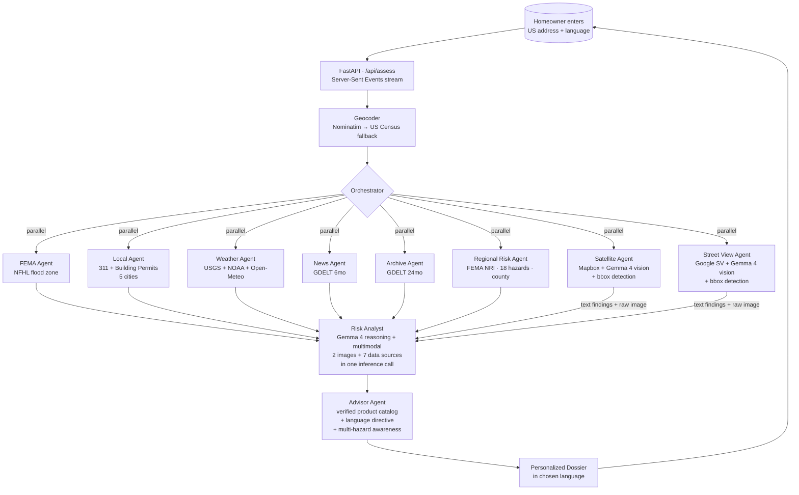

# FlutIQ

**Flood risk advice that doesn't make you Google "what is AEP."**

A multi-agent flood-risk advisor for US homeowners, built for the
[Gemma 4 Good Hackathon](https://www.kaggle.com/competitions/gemma-4-good)
(Global Resilience track). Type an address, get a personalized dossier
that explains your actual flood risk and the *real, currently-available*
insurance products that fit the property — not the made-up ones an LLM
might generate from outdated training data.

🌊 **Live demo:** [kredd25-flutiq.hf.space](https://kredd25-flutiq.hf.space)
&nbsp;·&nbsp;
**Status:** v0.15.2 · beta

> **Mission:** reduce the complexity and scariness of insurance.
> The technical pitch (FEMA-gap, multimodal Gemma 4, multi-agent
> orchestration) is the vehicle; the goal is making a homeowner feel
> less overwhelmed about their flood-insurance decisions.

---

## What's new since v0.7

- 🏢 **Commercial property detection** (v0.15.2) — the geocoder reads
  Nominatim's `class`/`type`/`name` metadata to classify a hit as
  residential or commercial. When the address resolves to a commercial
  building (an airport admin building, an office tower, a hospital),
  the dossier shows an amber "Commercial property" banner and
  *suppresses* the homeowner-specific sections — action plan,
  insurance options, before-you-sign checklist. The flood risk
  findings, multi-hazard NRI, and visual analysis still render
  because the building still floods. FlutIQ stays honest about who
  it's for: residential homeowners.
- 🔧 **Synthesis-receipt field fix** (v0.15.1) — the "Synthesized
  from…" strip was reading the wrong field name for building permits;
  fixed so the densification number ("Permits · 89 / $190M / 3y")
  surfaces reliably under the bottom-line verdict.
- 🏠🌐 **Dual-mode: FlutIQ Cloud + FlutIQ Edge** (v0.15) — same code,
  same agents, same dossier, two LLM endpoints. **Cloud** runs Gemma 4
  31B via OpenRouter (the live HF demo). **Edge** runs Gemma 4 e4b
  locally via Ollama on a MacBook — address never leaves the device,
  no API key, no internet for inference. Switched by a single env var
  (`INFERENCE_BACKEND=ollama`); the frontend re-skins itself with
  green accents and a "FlutIQ Edge" wordmark so a judge can tell
  modes apart at a glance. Directly addresses the hackathon's "local
  frontier intelligence" + "privacy is non-negotiable" framing.
- 🎯 **Expert-briefing dossier reframe** (v0.15) — the dossier now
  reads like what a flood-savvy friend would write up for someone
  about to live, buy, or rent here. Three additions:
  - **Bottom-line verdict**: the risk analyst writes a 3-5 sentence
    `plain_verdict` in second-person, ~10th-grade reading level —
    leads with the call, then the most important reason, then the
    trend direction. Surfaces as the first card under the score.
  - **Before-you-sign checklist**: the advisor produces 3-5 due-diligence
    items the reader should verify *this week*, each tagged with a
    citation chip back to the data layer that flagged it (FEMA, 311,
    Permits, City sewer, Satellite, Street view, NRI, USGS/NOAA).
  - **Bucketed mitigations**: the advisor's `mitigation_actions` are
    now grouped into *get water away / let it soak in / block the
    rest* — the prompt explicitly enumerates rainwater harvesting,
    permeable pavers, backwater valves, and groundwater recharge as
    valid actions. A 14-item list reads like a 3-step plan.
- 🧾 **Synthesis receipt** (v0.15) — a discreet "Synthesized from
  FEMA · 311 (n) · Permits (n / $M / 3y) · NRI · USGS · NOAA · 2 images"
  strip near the top of the dossier. Quietly tells the time-compression
  story: this is what would otherwise take a flood surveyor + permit
  researcher + insurance broker several weeks and several hundred
  dollars to assemble.
- 🛰️ **Multimodal risk analyst** (v0.9–v0.11) — the synthesis agent
  no longer just reads other agents' text findings; it gets the
  Street View photo *and* the Mapbox satellite image directly,
  alongside structured data, in one Gemma 4 call. The chain-of-thought
  trace explicitly cites which layer each claim comes from
  (Property / Neighborhood / Visual / Regional).
- 🎯 **Bounding-box detection on Street View** (v0.8) and on satellite
  (v0.11) — Gemma 4's native object detection draws boxes around
  each indicator it identifies (basement windows, parking lots,
  drainage features) on the actual image.
- 🏗️ **Building permits as a leading indicator** (v0.12) — alongside
  the historical 311 sewer-backup signal, the local agent now pulls
  recent construction permits within 1km/3y. The compound narrative
  ("clean 311 today + heavy densification = rising risk because the
  combined sewers serving these blocks aren't being upgraded") is
  something no other tool surfaces.
- 🌆 **Multi-city** (v0.13) — five Tier-1 cities supported with
  city-specific 311 + permits where available: Chicago (full),
  NYC (311 only — DOB datasets fragmented), SF (full), LA
  (permits-only — separated sewer system, no flood-coded 311),
  Austin (311 + permit-count). Each city's combined-vs-separated
  sewer literacy is injected into the local agent's prompt.
- 🌪️ **Multi-hazard regional context** (v0.14) — a new regional risk
  agent queries FEMA's National Risk Index via the RAPT ArcGIS REST
  endpoint. Every US county gets calibrated scores across 18 hazards
  (wildfire, hurricane, tornado, earthquake, etc.), plus Social
  Vulnerability and Community Resilience indices. FlutIQ is no
  longer flood-only.
- 🌐 **Multi-language dossier** (v0.7, still live) — Spanish, Mandarin,
  Vietnamese, Haitian Creole, Arabic, Tagalog. Product names, URLs,
  phone numbers stay English so the homeowner can still call the
  right number.
- ✅ **Verified insurance catalog** — the advisor agent can't invent
  products. All recommendations come from a hand-curated catalog of
  real, currently-available policies (NFIP post-Risk Rating 2.0,
  sewer/water-backup endorsements, parametric, private flood) with
  verified prices and contact info.

---

## The problem

FEMA's flood maps measure one specific thing: **riverine and coastal**
100-year flood zones. They don't measure sewer-backup flooding, the
dominant flood mode in flat cities with combined sewers (Chicago,
Cleveland, Detroit, Boston, much of the Northeast).

The result: 75% of US homeowners outside FEMA Special Flood Hazard
Areas don't carry flood insurance. Many of them flood anyway — through
their basement drain, not through their front yard — and discover at
the worst possible moment that homeowners insurance does **not** cover
flood damage.

FlutIQ exists to close that gap, in plain English.

---

## How it works



Nine specialist agents run on **Gemma 4** via OpenRouter:

- **7 data agents** fan out concurrently against free public APIs.
  Five do text-based ETL with LLM interpretation; **two
  multimodal agents** (Street View at eye-level, Satellite at
  bird's-eye) run dedicated **Gemma 4 vision** calls with
  bounding-box detection and produce structured findings BEFORE
  the synthesis. A new **regional risk agent** layers in FEMA's
  multi-hazard NRI for the wider county.
- **The risk analyst** synthesizes everything with Gemma 4's
  **reasoning mode** turned on AND **both raw images** as
  additional content parts in the same inference call. The
  chain-of-thought trace explicitly cites which signal layer
  each claim comes from: Property-level (FEMA, weather, USGS),
  Neighborhood-level (311 + permits), Visual (the two images
  the model is looking at), or Regional (NRI multi-hazard).
- **The advisor** picks from a hand-curated catalog of *real,
  verified* insurance products and writes the plain-English
  rationale for why each fits THIS property. It cannot invent
  products, prices, or contact info. Output generated directly
  in the homeowner's chosen language while keeping legal product
  names in English. Aware of the wider hazard mix from NRI but
  catalog-disciplined — won't drift into recommending non-flood
  products.

Every event in the pipeline streams to the browser via SSE so the
user watches agents light up live — no spinner, no black box.

---

## The verified-catalog approach (why this is different)

Most LLM-powered "advisor" tools are a thin wrapper around `chat.completions`
asking the model to recommend products from its training data. That's how
you end up suggesting an **NFIP Preferred Risk Policy** to a homeowner in
2026 — a product that was retired in October 2021 with Risk Rating 2.0,
and no longer exists.

FlutIQ's advisor agent is given a curated catalog of products that:

- Are **real and currently available** (verified on the web in 2026)
- Have correct, current pricing (or "varies — quote at floodsmart.gov"
  when honest)
- Have correct contact info (the Chicago Department of Water Management
  is `311` or `312-744-7000`, not the `312-747-7030` that the original
  spec suggested)

Gemma's job is to **pick which catalog products fit this address** and
**explain why in plain English**. The post-parse layer drops any
recommendation that doesn't reference a real catalog `product_id`.

The catalog lives in [`backend/app/data/insurance_catalog.py`](backend/app/data/insurance_catalog.py)
and is hand-edited. It's small on purpose — we'd rather ship 4 verified
products than 20 plausible-looking guesses.

---

## What you see (the dossier)

The dossier opens with a **risk score and headline**, then three
header cards from the v0.15 reframe:

- A **bottom-line verdict** — what a flood-savvy friend would tell
  you about this address in plain English, 3-5 sentences, leads with
  the call and then the most important reason. (residential only)
- A discreet **"Synthesized from …" receipt** strip listing the data
  layers that fed the briefing (FEMA · 311 · Permits · NRI · USGS ·
  NOAA · imagery). Quietly conveys the time-compression story.
- For **commercial properties**: an amber **banner** explaining that
  FlutIQ is built for homeowners and that the residential-specific
  sections are intentionally suppressed below. (v0.15.2)

Then the numbered sections, ordered for the mission (action first,
math last). Numbers are computed at render time based on which
conditional sections have data; residential-only sections are skipped
entirely for commercial properties.

1. **Before you sign — what to verify this week.** *(residential only;
   when the advisor produced a checklist)* 3-5 concrete things a
   flood-savvy buyer would check before signing a lease or closing
   a sale. Each item tagged with a citation chip back to the data
   layer that flagged it (FEMA, 311, Permits, City sewer, Satellite,
   Street view, NRI, USGS/NOAA).
2. **What to do once you live there.** *(residential only)* Concrete
   physical mitigations bucketed *get water away / let it soak in /
   block the rest*, sequenced cheapest-first within each group.
   (open by default)
3. **Insurance options, in plain English.** *(residential only)* TLDR
   banner, verified product cards with "what it covers," "what it
   *doesn't* cover," and "how to actually get it." Sorted: start
   here → also consider → only if. (open by default)
4. **What we saw at the property.** *(when Street View or satellite
   imagery has coverage)* Tabbed view of the actual images Gemma 4
   vision examined — Street level + Satellite. Each tab shows the
   image with **colored bounding boxes drawn around each indicator**
   the model identified, side-by-side with a numbered list of those
   indicators. Honest about confidence — won't fabricate features it
   can't see.
5. **Why FEMA's flood map isn't the whole story.** AEP math, 30-year
   cumulative probability, the multimodal-reasoning callout (image +
   data sources + chain-of-thought · one inference call), the
   development-pressure callout when permits are available, and the
   full Gemma 4 reasoning trace toggle. (closed by default — opt-in
   for the curious)
6. **Wider neighborhood — beyond just flooding.** FEMA National Risk
   Index multi-hazard profile for the property's county: composite
   score + rating, top 5 hazards (wildfire, hurricane, tornado, etc.),
   Social Vulnerability + Community Resilience indices, and Gemma's
   interpretation of what genuinely matters here. The signal that
   broadens FlutIQ from flood-only.
7. **The raw signals we looked at.** Stream gauges, alerts, historical
   events, FEMA panel. (closed by default)
8. **Recent local flood news.**

Plus a Leaflet map of the actual address with a 500m search-radius
ring matching the agents' query parameters, and a language picker
in the chrome bar (English, Español, 中文, Tiếng Việt, Kreyòl
ayisyen, العربية, Tagalog) that re-renders all user-facing copy
in the chosen language.

---

## Quick start (local)

```bash
git clone https://github.com/kredd2506/Gemma4Good_FlutIQ
cd Gemma4Good_FlutIQ/backend

python3.13 -m venv .venv
.venv/bin/pip install -r requirements.txt
cat > .env <<'EOF'
OPENROUTER_API_KEY=sk-or-v1-...   # required, see "BYOK" note below
GOOGLE_MAPS_API_KEY=AIzaSy...     # optional, enables Street View tab in §03
MAPBOX_ACCESS_TOKEN=pk.eyJ1...    # optional, enables Satellite tab in §03
EOF
set -a && source .env && set +a
.venv/bin/uvicorn app.main:app --port 8000

# Open http://127.0.0.1:8000
```

FastAPI serves both the API (`/api/*`) and the bundled frontend
(`/`) on a single port. No separate frontend dev server needed.

For deploy instructions (Hugging Face Spaces, ~10 min) see
[DEPLOY.md](DEPLOY.md).

### BYOK (bring your own key) is required

The default OpenRouter `:free` tier is a shared upstream pool that
rate-limits after ~2 calls. For a 7-agent system that means assessments
fail constantly. Required for any reliable run:

1. Get a free Google AI Studio key at [aistudio.google.com/apikey](https://aistudio.google.com/apikey)
2. Paste it into [openrouter.ai/settings/integrations](https://openrouter.ai/settings/integrations)
3. The same `:free` model IDs (`google/gemma-4-31b-it:free`,
   `google/gemma-4-26b-a4b-it:free`) now route through *your*
   personal Google AI Studio quota (15 RPM / ~1500 RPD per
   integration)

OpenRouter still bills `$0` — BYOK just escapes the shared rate-limit
pool.

### Smoke tests

```bash
cd backend
PYTHONPATH=. .venv/bin/python scripts/smoke_test.py     # Gemma 4 sanity
PYTHONPATH=. .venv/bin/python scripts/smoke_tools.py    # data tools
```

---

## Tech stack

| Layer | Choice | Why |
|-------|--------|-----|
| LLM | Gemma 4 (`google/gemma-4-31b-it:free` primary, 26b-a4b fallback) | Hackathon requires Gemma 4 |
| LLM gateway | OpenRouter free tier + BYOK Google AI Studio | $0, OpenAI-compatible API, escapes shared free-tier rate limits |
| Multimodal | Gemma 4 vision via OpenAI-format `image_url` content-part; native bounding-box detection (yxyx normalized 0-1000) | Single endpoint for text + image; box detection drives the dossier overlays |
| Backend | Python 3.13 + FastAPI + uvicorn + httpx | Async-native, SSE-friendly |
| Frontend | React via Babel-standalone (single `index.html`, served by FastAPI) | No build step, single deploy, no CORS |
| Map | Leaflet + OSM/CARTO tiles; SVG overlay for vision-agent bounding boxes | Free, no API key |
| Geocoding | Nominatim → US Census Geocoder fallback | Both free; Census has authoritative US TIGER coverage and returns county FIPS for the regional agent |
| Street View | Google Street View Static API (metadata-first, bearing-aimed at the building) | $200/mo Maps Platform free credit covers 28K images/mo |
| Satellite | Mapbox Static Images API (`satellite-v9` zoom 17) | 50K free static loads/mo per account |
| Data sources | FEMA NFHL + NRI · Chicago/NYC/SF/Austin 311 · Chicago/SF/LA/Austin building permits · USGS Water Services · NOAA NWS · Open-Meteo · GDELT | All free, no auth (NRI exposed via FEMA's RAPT ArcGIS REST endpoint) |
| Streaming | Server-Sent Events (POST + ReadableStream on the client) | Simpler than WebSocket; survives proxies |
| Hosting | Hugging Face Spaces (Docker SDK) | Free, single-URL deploy |

No database. No PII stored. Everything computed per-request.

---

## Project structure

```
backend/
├── app/
│   ├── main.py                FastAPI + CORS + static mount
│   ├── config.py              env + model IDs + 3rd-party keys
│   ├── api/
│   │   ├── health.py          GET /api/health
│   │   └── assess.py          POST /api/assess (SSE)
│   ├── agents/
│   │   ├── orchestrator.py    parallel-then-sequential runner
│   │   ├── fema_agent.py      property-level FEMA flood zone
│   │   ├── local_agent.py     city-aware: 311 + building permits
│   │   ├── weather_agent.py   USGS + NOAA + Open-Meteo
│   │   ├── news_agent.py      GDELT 6mo
│   │   ├── archive_agent.py   GDELT 24mo
│   │   ├── regional_risk_agent.py  FEMA NRI county-level multi-hazard
│   │   ├── satellite_agent.py    Gemma 4 vision (bird's-eye, bbox)
│   │   ├── streetview_agent.py   Gemma 4 vision (eye-level, bbox)
│   │   ├── risk_agent.py      multimodal synthesis (2 images + 7 data)
│   │   └── advisor_agent.py   catalog-driven, no inventing, multilingual
│   ├── tools/
│   │   ├── geocoder.py        Nominatim → Census (returns county FIPS)
│   │   ├── fema.py            FEMA NFHL ArcGIS REST
│   │   ├── chicago_311.py     Socrata SODA — generic, city-aware
│   │   ├── building_permits.py  Socrata — new construction + renovations
│   │   ├── nri_county.py      FEMA NRI via RAPT ArcGIS REST
│   │   ├── streetview.py      Google SV Static (metadata-first, bearing-aimed)
│   │   ├── mapbox.py          Mapbox Static Images (satellite + outdoors)
│   │   ├── usgs.py            stream gauges
│   │   ├── noaa.py            forecast + flood alerts
│   │   ├── open_meteo.py      flood + precipitation
│   │   └── gdelt.py           DOC API + per-IP rate-limit lock
│   ├── llm/
│   │   ├── client.py          OpenRouter wrapper, 429+5xx retries
│   │   └── prompts.py         layered-signal system prompts
│   └── data/
│       ├── cities.py              5-city registry (Chicago, NYC, SF, LA, Austin)
│       ├── insurance_catalog.py   curated REAL products
│       └── languages.py           7-language registry + prompt directive
├── scripts/                   smoke tests (basic, tools, vision, bbox, cities)
├── static/
│   └── index.html             single-file React + Leaflet frontend
├── Dockerfile                 HF Spaces ready (COPYs app/ + static/)
├── requirements.txt
└── README.md                  HF Spaces frontmatter

README.md                      this file (GitHub landing page)
DEPLOY.md                      step-by-step HF Space deploy guide
STATUS.md                      detailed working snapshot
SKILL.md                       Claude Code skill (project rules)
FLOODIQ_BACKEND_SPEC.md        original 1086-line build spec
```

---

## What's intentionally not in scope

- **No Vite / React build pipeline.** Single-file `index.html` deploys
  anywhere with no toolchain. Easy to read, easy to fork.
- **No database.** Everything per-request. No PII stored.
- **No write actions on behalf of the user.** No auto-purchasing
  insurance, no auto-filing claims. The advisor surfaces *what to do*
  and *who to call*; the user does it.
- **No follow-up conversation (yet).** The dossier is one-shot.
  Multi-turn function-calling chat is on the roadmap.
- **5 Tier-1 cities only for 311 + permits.** Chicago, NYC, SF, LA,
  Austin. Adding Boston / Houston / Miami / Seattle is one registry
  entry plus per-city flood-category mapping each — the architecture
  is parameterized; the integrations aren't (Boston uses CKAN not
  Socrata; Houston / Miami / Seattle have working APIs but different
  field names). NRI multi-hazard works for **all** US counties.
- **No NOAA Storm Events DB integration.** That dataset only exists as
  CSV bulk-download per year; ingesting it for a hackathon is
  disproportionate. We use GDELT 24-month news as a proxy for
  historical flood track record.
- **No real elevation contours.** Tried and dropped — Mapbox outdoors
  doesn't show contours in dense urban areas (verified for Chicago
  and Atlanta), and FEMA's Topo basemap is too sparse for flat metros.
  The satellite agent's catchment analysis fills the gap.

See [STATUS.md](STATUS.md) for a fuller snapshot of what's working,
what wobbles, and what's left.

---

## Hackathon

Built for the **Gemma 4 Good Hackathon** on Kaggle, deadline May 18,
2026. Track: **Global Resilience** (climate adaptation, disaster
preparedness, community resilience).

What FlutIQ demonstrates from the Gemma 4 capabilities surface:

- **Native function calling** — verified end-to-end on the `:free`
  tier (see [`scripts/smoke_test.py`](backend/scripts/smoke_test.py))
- **Reasoning mode** (`reasoning: {enabled: true}`) — the risk
  analyst's chain-of-thought trace is preserved on every dossier and
  shown in the UI behind a toggle
- **Multimodal vision in two dedicated agents** — Street View
  (eye-level) and Mapbox satellite (bird's-eye) each run their own
  Gemma 4 vision call (see [`scripts/smoke_test_vision.py`](backend/scripts/smoke_test_vision.py))
- **Native bounding-box detection** — both vision agents return
  yxyx normalized 0-1000 boxes that the dossier overlays as SVG
  (see [`scripts/smoke_test_bbox.py`](backend/scripts/smoke_test_bbox.py))
- **Interleaved multimodal reasoning** — the risk analyst receives
  *both raw images* alongside structured findings from 7 data agents
  in a single Gemma 4 inference call. Reasoning trace cites which
  layer each claim comes from (Property / Neighborhood / Visual /
  Regional)
- **Agentic workflows** — 9 agents, parallel-then-sequential
  orchestration, SSE streaming, graceful per-agent error handling
- **Long context** (256K) — comfortably handles 2 images + the
  full data-bundle prompt (~8–12K text tokens + image tokens)
- **140+ language support** — user-facing dossier copy generated in
  any of 7 supported languages with a single prompt directive,
  preserving English product names and URLs

The submission also targets the **Digital Equity & Inclusivity**
Impact Prize via the language picker — the same flood-risk briefing
in Spanish, Mandarin, Vietnamese, Haitian Creole, Arabic, or Tagalog
without rephrasing or re-prompting.

---

## Credits

- **Data sources** — FEMA (NFHL + NRI via RAPT), USGS, NOAA, Open-Meteo,
  GDELT, OpenStreetMap / CARTO, plus city open-data portals (Chicago,
  NYC, SF, LA, Austin). All free and public.
- **Imagery** — Google Street View (free tier under the Maps Platform
  monthly credit) for eye-level; Mapbox Static Images (50K free
  static loads/month) for satellite.
- **Hackathon** — [Gemma 4 Good Hackathon](https://www.kaggle.com/competitions/gemma-4-good) by Google + Kaggle.
- **Built with** — [Claude Code](https://claude.com/claude-code) (Anthropic's CLI for Claude).
- **Mascot** — Tiny droplet of agency in a sea of insurance jargon.

---

## License

This repository is intended for hackathon submission and reference.
A formal license will be added before submission.

The verified insurance catalog (`backend/app/data/insurance_catalog.py`)
is informational only and is **not financial, legal, or insurance
advice**. Confirm specifics with a licensed broker before purchasing
coverage.
